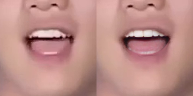

## A sample Teeth_enhance Project

### Demo
#### :panda_face: Head teeth enhance
  
  
  
  

#### :panda_face: Body teeth enhance


### Dependencies and Installation

- Pytorch >= 1.7.1
- CUDA >= 10.1
- Other required packages in `requirements.txt`
```
# git clone this repository
git clone https://github.com/yylgoodlucky/Teeth_enhance
cd Teeth_enhance

# create new anaconda env
conda create -n Teeth_enhance python=3.8 -y
conda activate Teeth_enhance

# install python dependencies
pip3 install -r requirements.txt
```
<!-- conda install -c conda-forge dlib -->

### Quick Inference
#### Download Pre-trained Models:
Download pre-trained models: [GFPGANv1.3.pth](https://github.com/TencentARC/GFPGAN/releases/download/v1.3.0/GFPGANv1.3.pth) and save it in `models/gfpgan/weights`.

```bash
wget https://github.com/TencentARC/GFPGAN/releases/download/v1.3.0/GFPGANv1.3.pth -P models/GFPGAN/weights
```

Download pre-trained models: [parsing](https://drive.google.com/open?id=154JgKpzCPW82qINcVieuPH3fZ2e0P812) and save it in `models/face_parsing/weights`.

#### Demo:
```bash
python enhance.py 
    --input_path sample/yangmi.mp4 
    --save_path sample
```


### References
- [BiSeNet](https://github.com/CoinCheung/BiSeNet)
- [GFPGAN](https://github.com/TencentARC/GFPGAN)